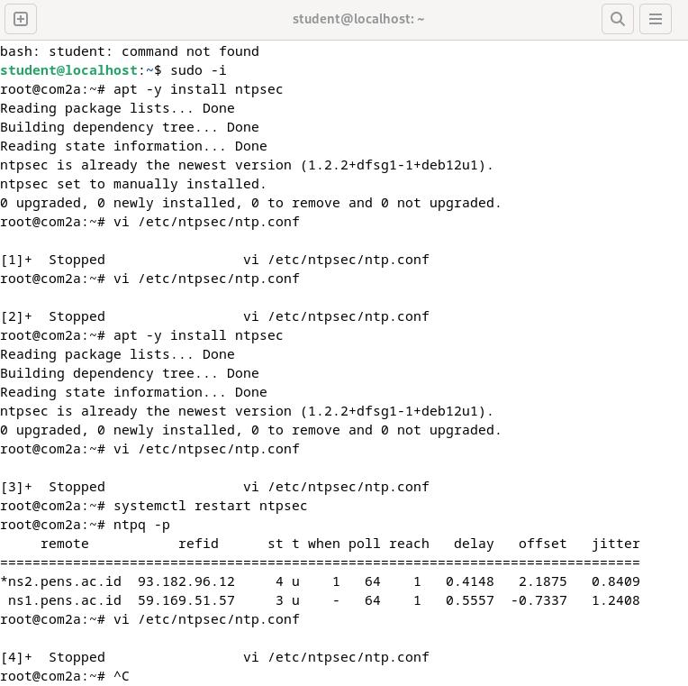

  <h1 class="text-align: center;font-weight: bold">Praktikum 2 (Config & NTP Client)
   Workshop Administrasi Jaringan 2025</h1>
  <h3 class="text-align: center;">Dosen Pengampu : Dr. Ferry Astika Saputra, S.T., M.Sc.</h3>

 

  
  <h3 style="text-align: center;">Disusun Oleh : </h3>
  

  <strong>Nama : Bayu Ariyo Vonda Wicaksono<strong>
   <strong>NRP : 3123500017<strong>
   <strong>Kelas : 2 D3 IT A<strong>
  

## A. Konfigurasi dan Instalasi NTP Client
  
### 1. Install NTP Client 
>$ apt -y install ntpsec

<h3>
Hasil
</h3>

NTP Client telah terinstall pada OS Linux Debian 12 dengan masuk sebagai root terlebih dahulu.

### 2. Konfigurasi pada ntp.conf 
> $ nano /etc/ntpsec/ntp.conf

<h3>
Hasil
</h3>

Hapus komen untuk Pool 0 hingga Pool 3, kemudian tambahkan dibawahnya "pool ntp.nict.jp iburst" Lalu simpan perubahan kemudian keluar.

### 3. Restart NTP dan Verifikasi Status
> $ systemctl restart ntpsec

> $ ntpq -p

<h3>
Hasil
</h3>

Fungsi restart NTP untuk membaca konfigurasi yang telah ditambahkan pada langkah kedua. Kemudian verifikasi status menampilkan daftar server NTP yang tergabung dalam pool zona Indonesia. Yang berarti server-server ini berada di wilayah Indonesia atau ditujukan untuk pengguna di Indonesia agar mendapatkan waktu yang lebih akurat dengan latensi lebih rendah.

## B. Instalasi dan Konfigurasi Samba
### 1. Install Samba pada terminal
> $ apt install -y samba

<h3>
Hasil
</h3>

Instalasi samba menggunakan perintah seperti pada gambar, Masuk sebagai Root terlebih dahulu.

### 2. Membuat Folder kosong pada direktori Home dan mengubah izin.
> $ apt install -y samba

> $ chmod 777 /home/share

<h3>
Hasil
</h3>

Pada Gambar tersebut berfungsi untuk membuat folder "share" pada direktori home kemudian mengubah izin pada folder tersebut agar semua pengguna dapat membaca,menulis dan mengeksekusi.

### 3. Konfigurasi smb.conf untuk public shared
> $ nano /etc/samba/smb.conf

<h3>
Hasil
</h3>

.png)

Pada bagian [global] tambahkan "unix charset = UTF-8" yang berfungsi untuk mengatur karakter encoding pada sistem Unix/Linux.

.png)

Pada bagian interfaces tambahkan network yang akan diizinkan untuk mengakses, saya menggunakan network pada windows yaitu "172.20.10.0/24"

Tambahkan konfigurasi [Share] dan tambahkan juga path beserta izin folder seperti pada gambar kemudian simpan perubahan dan keluar.

### 4. Restart Samba service dan Pengujian untuk Public Shared
> $ systemctl restart smbd

<h3>
Hasil
</h3>

.png)

Untuk mengakses pada Windows gunakan IP yang terdaftar pada Linux kemudian akses seperti gambar diatas.

Disini saya menambahkan Folder "BERHASIL" di dalam nya, maka pada direktori home/share yang terdapat pada Linux Debian akan bertambah juga seperti pada Windows.

### 5. Mengakses Public shared menggunakan CLI dan file manager
> $ smbclient //100.100.20.98/share -N

<h3>
Hasil
</h3>

Gambar tersebut membuktikan bahwa folder share yang dibuat menggunakan samba dapat diakses menggunakan CLI.

#### Akses via file manager
.png)

Untuk mengakses menggunakan file manager dengan mengetik "smb://100.100.20.98/share" kemudian klik connect.

### 6. Konfigurasi Limited Shared Folder
> $ nano /etc/samba/smb.conf

<h3>
Hasil
</h3>

.png)

Tambahkan konfigurasi di dalam smb.conf untuk [Limited] seperti pada gambar diatas.

.png)

Tambahkan user yang dapat mengakses folder tersebut

.png)

Set password untuk user yang telah ditambahkan

### 7. Restart Samba service dan Pengujian untuk Limited shared folder
> $ systemctl restart smbd

<h3>
Hasil
</h3>

Ketika mengakses Limited dengan network yang telah ditambahkan maka akan tampil seperti gambar tersebut. Masukkan username dan password yang telah dibuat pada langkah Sebelumnya.

### 8. Mengakses via CLI dan File manager untuk Limited shared folder
> $ smbclient //192.168.100.173/shared01 -U sambauser

<h3>
Hasil
</h3>

Masukkan password yang telah dibuat, kemudian dapat mengakses Limited Akses Folder tersebut

### Mengakses via file manager

Masukkan IP yang terdaftar dan direktori limited

Masukkan username dan password yang telah dibuat pada langkah sebelumnya

Mengakses via File manager berhasil

## C. Rangkuman Package Management materi pada Ethol

1. Debian 12
Debian adalah sistem operasi Linux yang terkenal karena stabilitas dan keamanannya.
Versi terbaru, Debian 12 (Bookworm), menghadirkan berbagai pembaruan dan peningkatan kinerja dibandingkan versi sebelumnya.
2. Proses Instalasi Debian 12
Buku ini menguraikan langkah-langkah instalasi Debian 12, termasuk pemilihan paket dan pengaturan awal sistem.
Dijelaskan pula penggunaan Debian Installer untuk mengelola partisi, akun pengguna, serta konfigurasi jaringan dasar.
3. Pengelolaan Pengguna dan Hak Akses
Menjelaskan cara membuat, menghapus, serta mengatur akun pengguna dalam Debian 12.
Pembahasan mengenai sistem izin file (permissions), grup pengguna, dan kebijakan keamanan yang perlu diterapkan.
4. Pengelolaan Paket dengan APT
Cara menginstal, memperbarui, dan menghapus perangkat lunak menggunakan perintah seperti apt-get, apt-cache, dan dpkg.
Penjelasan tentang repositori Debian serta cara menambahkan sumber paket baru ke dalam sistem.
5. Konfigurasi Jaringan
Membahas dasar-dasar pengaturan jaringan, termasuk alamat IP, DNS, dan gateway.
Penggunaan perintah ip, ifconfig, serta nmcli untuk mengelola koneksi jaringan.
6. Administrasi Sistem
Memantau performa sistem dengan perintah seperti top, htop, df, dan free.
Mengelola layanan menggunakan systemd (systemctl start/stop/status).
Konfigurasi keamanan jaringan melalui ufw atau iptables.
7. Keamanan Sistem
Panduan untuk meningkatkan keamanan Debian 12, seperti pembaruan sistem, manajemen akses pengguna sudo, serta pengamanan akses SSH.
Penggunaan fail2ban sebagai perlindungan terhadap serangan brute-force.
8. Backup dan Pemulihan Data
Strategi pencadangan menggunakan rsync, tar, dan cron jobs.
Metode pemulihan sistem dalam situasi kehilangan data atau kerusakan sistem.
9. Automasi dengan Skrip Bash
Pengantar scripting menggunakan Bash untuk mengotomatisasi tugas administrasi sistem.
Contoh skrip sederhana untuk monitoring sistem dan pembaruan otomatis.

## Referensi
[NTP Client](https://www.server-world.info/en/note?os=Debian_12&p=ntp&f=1)

[Samba](https://www.server-world.info/en/note?os=Debian_12&p=samba&f=1)

