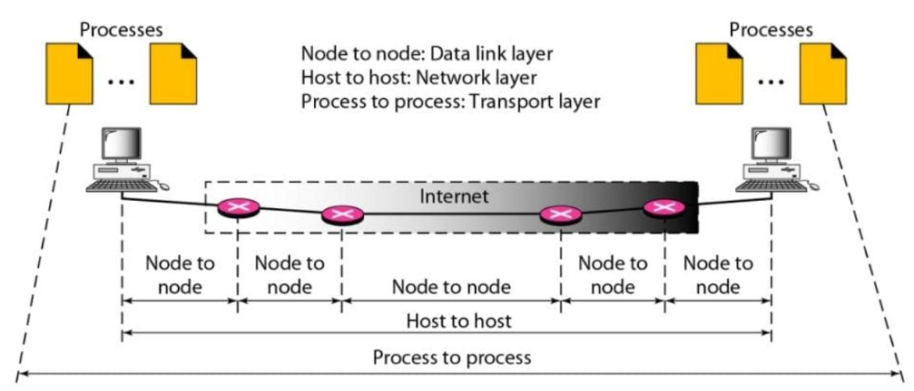

<div align="center">
  <h1 class="text-align: center;font-weight: bold">Praktikum 1 (Review Konsep Jaringan)
  <br>Workshop Administrasi Jaringan 2025</h1>
  <h3 class="text-align: center;">Dosen Pengampu : Dr. Ferry Astika Saputra, S.T., M.Sc.</h3>
</div>
<br />
<div align="center">
  
  <h3 style="text-align: center;">Disusun Oleh : </h3>
  <p style="text-align: center;">
  <strong>Nama : Bayu Ariyo Vonda Wicaksono<strong>
  <br><strong>NRP : 3123500017<strong>
  <br><strong>Kelas : 2 D3 IT A<strong>
  </p>

<h3 style="text-align: center;line-height: 1.5">Politeknik Elektronika Negeri Surabaya<br>Departemen Teknik Informatika Dan Komputer<br>Program Studi Teknik Informatika<br>2024/2025</h3>
  <hr><hr>
</div>

<br>
<h2>Review Konsep Jaringan</h2>
<h4>1. Analisa Versi HTTP, IP Address dari client maupun server, berapa durasi waktu dari client mengirimkan HTTP request hingga waktu dari server mengirimkan ke server.
<br><br> Jawaban :</h4>
<br>

```
Versi : HTTP/1.1
```


```
IP HTTP Client : 145.254.160.237
```


```
Durasi HTTP Request : 0.911310
```


```
Durasi HTTP Response : 3.955688
```


```
Durasi waktu dalam 1 sesi HTTP Response : 4.846969 - 3.955688 = 0.891281
```


<h4>2. Deskripsikan gambar pada slide 3</h4>



<p style="text-align: center;font-weight: lighter">Figure 23.1 Types of data deliveries slide PPT</p>

<p style="font-weight: lighter">
1. Pada Lapisan Transport, komunikasi berlangsung antara aplikasi di perangkat pengirim dan penerima. Data dikemas dalam bentuk segmen yang mencakup header dengan nomor port, yang memastikan data dikirimkan ke aplikasi yang benar. Proses ini melibatkan penggunaan protokol seperti TCP dan UDP.
<br><br>
2. Pada Lapisan Jaringan, data dikemas menjadi paket dan dikirim dari komputer pengirim ke komputer penerima melalui jaringan internet. Protokol yang terlibat adalah IP. Proses yang terjadi meliputi: **Pengalamatan IP** — setiap paket diberi alamat IP sumber dan tujuan, serta **Routing** — paket dikirim melalui sejumlah router hingga mencapai tujuan akhir.
<br><br>
3. Pada Lapisan Data Link, data dikemas dalam frame dan dikirimkan antar perangkat jaringan, seperti switch atau router. Protokol yang digunakan termasuk Ethernet, Wi-Fi, atau PPP untuk komunikasi di jaringan lokal. Proses yang terjadi meliputi: **Pengalamatan MAC** — setiap frame diberi alamat MAC sumber dan tujuan untuk komunikasi dalam jaringan lokal, serta **Deteksi Kesalahan** — data diperiksa untuk memastikan tidak ada kesalahan selama transmisi.
<br><br>
Jadi, dalam gambar tersebut, terjadi tiga jenis proses utama :
<br>Proses ke Proses (Transport Layer)
<br>Host ke Host (Network Layer)
<br>Node ke Node (Data Link Layer)
<br>Setiap proses ini bekerja sama untuk memastikan data <br>dikirim dengan benar dari satu komputer ke komputer lain di jaringan.
<br><br>
</p>

<h4>3. Rangkuman tahapan komunikasi menggunakan TCP<h4>

<p style="font-weight: lighter">
1. Three-Way Handshake (Membangun Koneksi)
<br>Pengirim mengirim SYN ke penerima.
<br>Penerima membalas dengan SYN-ACK.
<br>Pengirim mengonfirmasi dengan ACK, koneksi terbentuk.
<br><br>
2. Data Transmission (Pengiriman Data)
<br>
Data dibagi menjadi segmen dan diberi sequence number.
<br>Penerima mengirim ACK untuk setiap segmen yang diterima.
<br>Jika segmen hilang, TCP akan mengirim ulang (retransmission).
<br>Sliding Window digunakan untuk mengontrol jumlah data yang dikirim.
<br><br>
3. Four-Way Handshake (Menutup Koneksi)
Pengirim mengirim FIN, penerima membalas ACK. Penerima mengirim FIN, pengirim membalas ACK. Koneksi ditutup setelah TIME_WAIT selesai.
</p>
