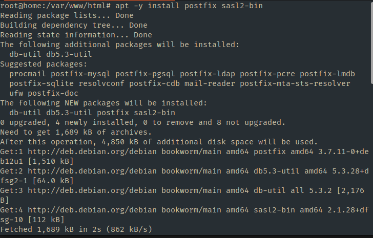
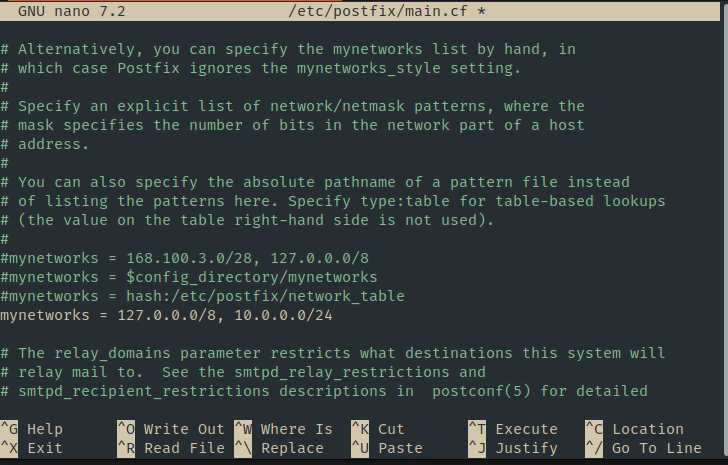
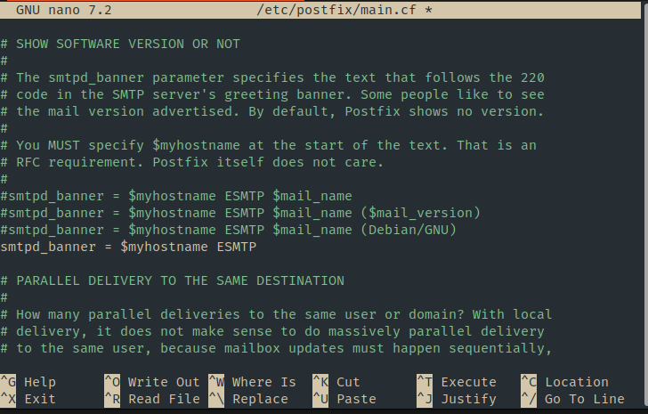
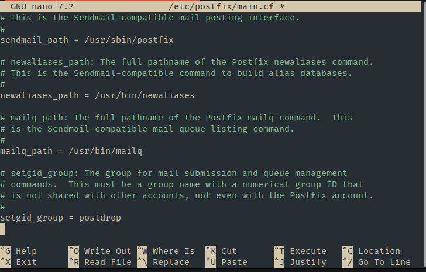
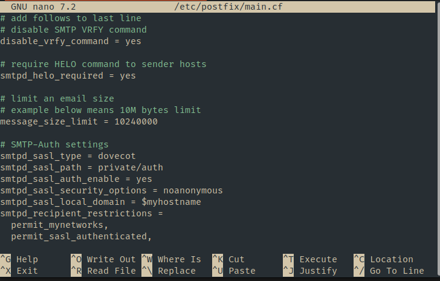

  

  <h1 class="text-align: center;font-weight: bold">Praktikum 11 
   Workshop Administrasi Jaringan</h1>
  <h3 class="text-align: center;">Dosen Pengampu : Dr. Ferry Astika Saputra, S.T., M.Sc.</h3>

 

  
  <h3 style="text-align: center;">Disusun Oleh : </h3>
  

  <strong>Nama : Bayu Ariyo Vonda Wicaksono<strong>
   <strong>NRP : 3123500017<strong>
   <strong>Kelas : 2 D3 IT A<strong>
  

<h3 style="text-align: center;line-height: 1.5; text-transform: uppercase">Politeknik Elektronika Negeri Surabaya Departemen Teknik Informatika Dan Komputer Program Studi Teknik Informatika 2025</h3>
  

<h3 style="text-align: center;line-height: 1.5">Praktikum Minggu 11</h3>

## Pengantar Electronic Mail (Email)

**Electronic Mail (Email)** adalah salah satu layanan komunikasi paling populer di internet. Email memungkinkan pengguna untuk mengirim dan menerima pesan secara elektronik dalam hitungan detik ke seluruh dunia.

### Sejarah Singkat Email

- Email pertama kali dikembangkan pada awal 1970-an oleh Ray Tomlinson.
- Awalnya, email hanya digunakan untuk bertukar pesan antar pengguna di komputer yang sama.
- Seiring berkembangnya jaringan komputer, email menjadi alat komunikasi global.

### Cara Kerja Email

Email bekerja dengan menggunakan model client-server. Berikut adalah proses dasar pengiriman email:

1. **Penulisan Pesan:** Pengguna menulis pesan di aplikasi email (client).
2. **Pengiriman:** Pesan dikirim ke server email pengirim menggunakan protokol SMTP (Simple Mail Transfer Protocol).
3. **Penerusan:** Server email pengirim meneruskan pesan ke server email penerima.
4. **Penyimpanan:** Server email penerima menyimpan pesan di mailbox penerima.
5. **Pengambilan:** Penerima mengambil pesan dari server menggunakan protokol POP3 (Post Office Protocol) atau IMAP (Internet Message Access Protocol).

### Komponen Email

- **Mail User Agent (MUA):** Aplikasi yang digunakan pengguna untuk mengirim/menerima email (misal: Outlook, Gmail).
- **Mail Transfer Agent (MTA):** Server yang bertugas mengirim/meneruskan email antar server.
- **Mail Delivery Agent (MDA):** Server yang menyimpan email di mailbox penerima.

### Protokol Email

- **SMTP:** Untuk mengirim email dari client ke server dan antar server.
- **POP3:** Untuk mengambil email dari server ke client, biasanya menghapus email dari server setelah diambil.
- **IMAP:** Untuk mengambil email dari server ke client, namun email tetap tersimpan di server.

### Fitur Email

- **Attachment:** Mengirim file bersama pesan.
- **CC/BCC:** Mengirim salinan email ke beberapa penerima.
- **Address Book:** Menyimpan daftar kontak.
- **Folders:** Mengatur email dalam folder-folder.

### Kelebihan Email

- Cepat dan efisien.
- Biaya rendah.
- Dapat mengirim ke banyak penerima sekaligus.
- Mendukung pengiriman file.

### Kekurangan Email

- Rentan terhadap spam dan virus.
- Ketergantungan pada koneksi internet.
- Privasi dan keamanan bisa menjadi isu.

---

## Kesimpulan

Email adalah layanan komunikasi digital yang sangat penting dan telah merevolusi cara manusia berkomunikasi, baik secara personal maupun profesional. Dengan memahami cara kerja dan komponennya, kita dapat memanfaatkan email secara lebih efektif dan aman.

### Konfigurasi email server

#### 1. Instalasi Paket Postfix dan sasl2-bin

#### 2. Konfigurasi Dasar Potfix untuk Mail Transfer Agent (MTA)

2.1. Salin file konfigurasi dengan menggunakan perintah ini `cp /usr/share/postfix/main.cf.dist /etc/postfix/main.cf`

2.2. Edit file `/etc/postfix/main.cf` dengan menggunakan perintah `nano /etc/postfix/main`

2.3. Konfigurasi Hostname & Domain di Postfix

2.4. Menambahkan Jaringan Lokal

2.5. Hapus komentar pada SMPTD Banner

2.6. Tambahkan konfigurasi path untuk mail 

2.7. Konfigurasi autentikasi postfix

2.9. Terapkan perubahan dengan perintah  `newaliases`

2.8. Restart layanan paket postfix `systemctl restart postfix`
  

