<div align="center">
  <h1 class="text-align: center;font-weight: bold">Praktikum 6
  <br>Workshop Administrasi Jaringan 2025</h1>
  <h3 class="text-align: center;">Dosen Pengampu : Dr. Ferry Astika Saputra, S.T., M.Sc.</h3>
</div>
<br />
<div align="center">
  
  <h3 style="text-align: center;">Disusun Oleh : </h3>
  <p style="text-align: center;">
  <strong>Nama : Bayu Ariyo Vonda Wicaksono<strong>
  <br><strong>NRP : 3123500017<strong>
  <br><strong>Kelas : 2 D3 IT A<strong>
  </p>
  <h3 style="text-align: center;line-height: 1.5">Politeknik Elektronika Negeri Surabaya<br>Departemen Teknik Informatika Dan Komputer<br>Program Studi Teknik Informatika<br>2025/2026</h3>
  <br><hr><br>
</div>

# Menggunakan dua virtual machine

Pada praktikum ini, digunakan dua jenis Virtual Machine, yaitu Debian dengan antarmuka grafis (GUI) dan Debian tanpa GUI. Tujuan dari praktikum ini adalah menghubungkan kedua VM agar dapat saling terhubung. VM1 merupakan mesin tanpa GUI yang dikonfigurasi menggunakan bridge network, sementara VM2 menggunakan GUI dan memanfaatkan internal network serta dikonfigurasi dengan Samba. Fokus utama praktikum ini adalah pada pengaturan jaringan di VM1.

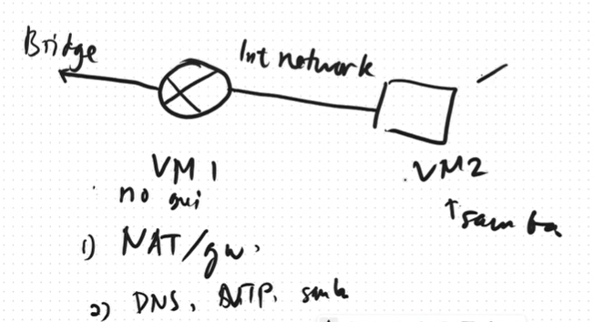

# **Konfigurasi Koneksi VM1 dan VM2**

## **Network Interface**

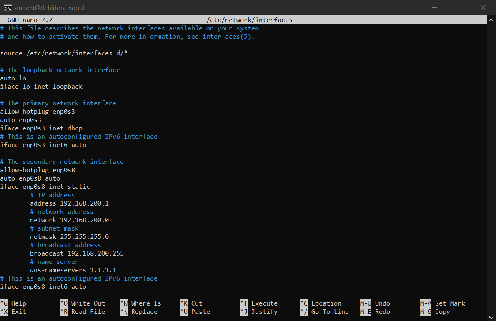

Pada gambar diatas, konfigurasi termasuk mengatur interface loopback (lo) untuk berkomunikasi internal dengan 127.0.0.1 dan dua interface fisik.

- Konfigurasi interface pertama (enp0s3) menggunakan allow-hotplug untuk mengaktifkan interface secara otomatis saat perangkat terdeteksi. Ini juga dikonfigurasi untuk mendapatkan alamat IPv4 secara dinamis melalui DHCP, sementara pengaturan IPv6 dilakukan dengan autoconfiguration.
- Interface kedua (enp0s8) dikonfigurasi dengan kombinasi allow-hotplug dan auto untuk memastikan interface tetap aktif saat booting. Ini juga dikonfigurasi secara statis dengan alamat IP 192.168.200.1, netmask 255.255.255.0, broadcast 192.168.200.255, dan pengaturan jaringan melalui baris network 192.168.200.0. Selain itu, IPv6 pada interface ini juga dikonfigurasi secara autokonfigurasi.
- Pada sistem operasi Unix/Linux, 127.0.0.1 adalah alamat loopback umum yang digunakan untuk komunikasi internal. Meskipun angka 127.0.0.1 tidak disebutkan secara eksplisit dalam file konfigurasi, baris konfigurasi iface lo inet loopback secara implisit menunjukkan bahwa interface loopback (loopback) menggunakan alamat tersebut. Ini karena alamat ini telah distandarisasi dan secara default digunakan oleh sistem.

## **IPv4 Forwarding**


Baris net.ipv4.ip_forward=1 memungkinkan sistem Linux mengirimkan paket data IPv4 ke interface jaringan. Ini memungkinkan komputer berfungsi sebagai router atau gateway dan dapat menghubungkan dan mengirimkan trafik ke berbagai jaringan. Baris ini juga merupakan bagian penting dari implementasi NAT, VPN, dan solusi jaringan lainnya.


Sistem kontrolnya menunjukkan bahwa konfigurasi IP Forwardnya diubah menjadi 1. Perintah IP forward ini menunjukkan bahwa dua interface (enp0s8 dan enp0s3) dapat mengirimkan paket satu sama lain.

---

# Konfigurasi NAT

## **Instalasi iptables dan iptables-persistent**


## **Membuat iptables rules**

Membuat iptables rules pada file `rules.v4`

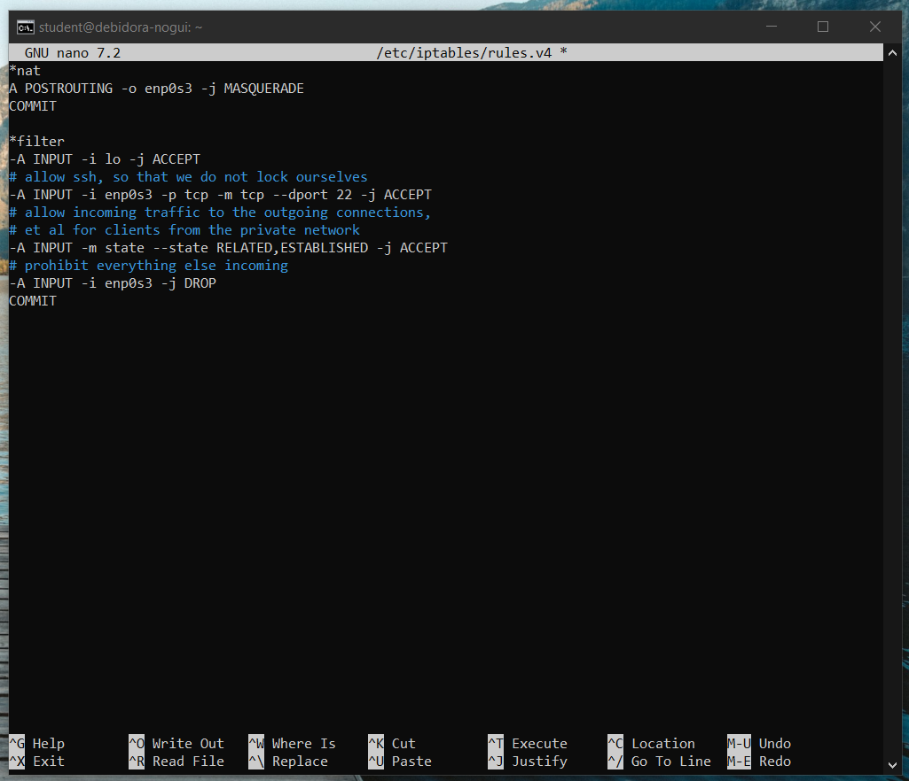

Konfigurasi aturan ini akan membuat VM 1 berfungsi sebagai router dengan NAT, yang menghubungkan dua interface ens33 dan ens37, sehingga ens37 dapat terhubung ke internet tetapi tidak menggunakan IP Publik melainkan diwakili oleh ens33.\

Jalankan perintah `sudo iptables-save > /etc/iptables/rules.v4` untuk menyimpan konfigurasi iptables

## **Setting VM2 Network Manager**

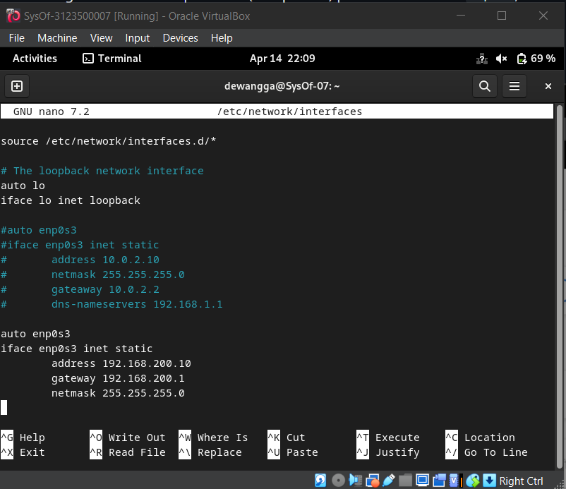

Setelah konfigurasi, maka VM1 dan VM2 sudah terhubung dalam satu network.

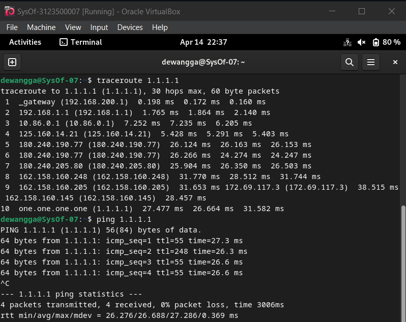

---

## **Konfigurasi NTP VM1**

Langkah pertama untuk konfigurasi NTP adalah melakukan instalasi NTP pada VM1.

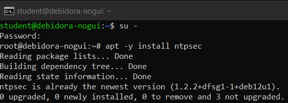

Menambahkan NTP Server ke timezone yang sesuai; dalam praktikum ini, timezone yang digunakan adalah Indonesia, yaitu id

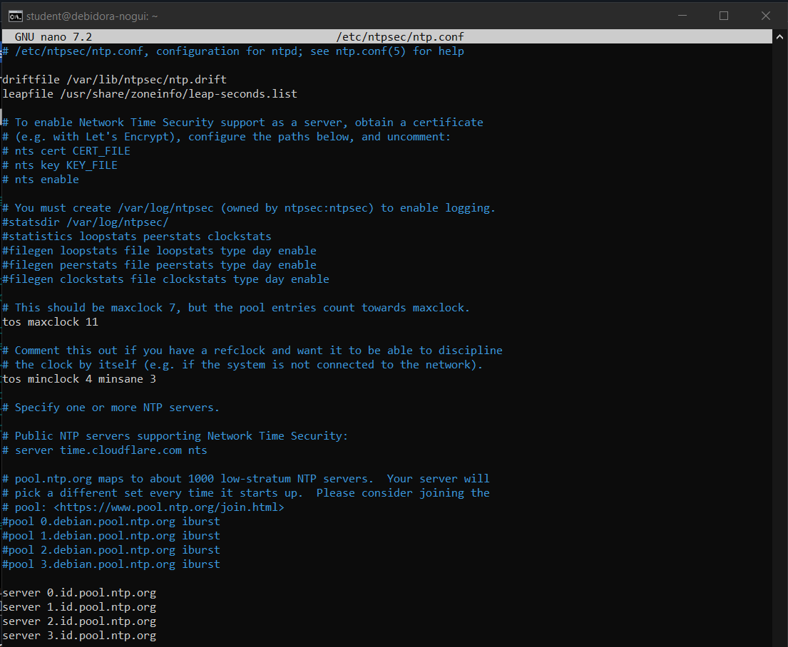

Restart NTP dan lakukan percobaan dengan command `ntpq -p`


## **Konfigurasi Samba VM1**

**Langkah pertama untuk konfigurasi NTP adalah melakukan instalasi Samba pada VM1.**


Konfigurasi Samba yang akan digunakan disini adalah fully share folder.

**Langkah kedua yang dilakukan adalah membuat shared folder dengan command berikut**

```jsx
root@smb:~# mkdir /home/share
root@smb:~# chmod 777 /home/share
```

**Lalu lakukan konfigurasi pada /etc/samba/smb.conf**

Tambahkan unix charset = UTF-8 dan interfaces 127.0.0.0/8 10.0.0.0/24 192.0.0.0/24

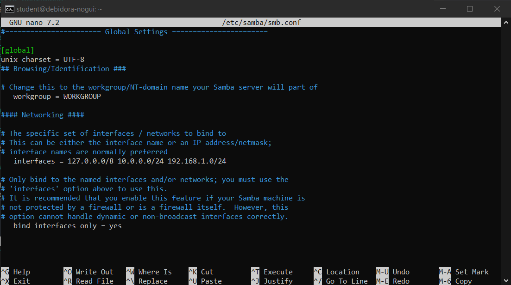
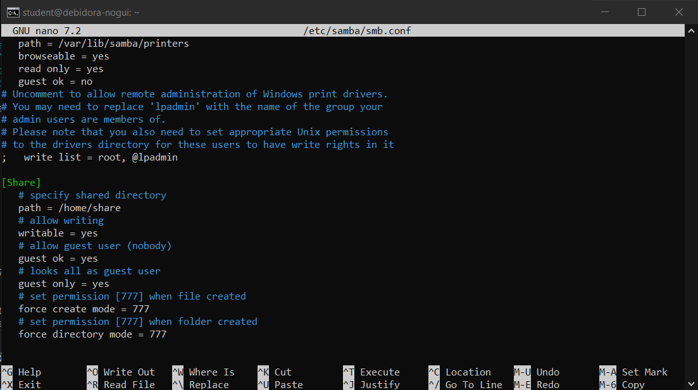

Save lalu lakukan restart smbd

Restart smbd menggunakan command `systemctl restart smbd`


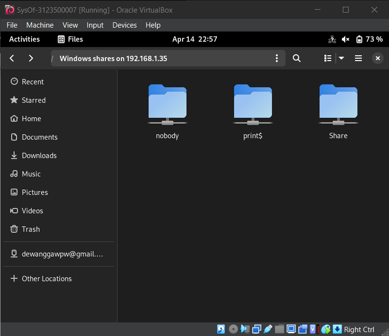

## **Konfigurasi DNS VM1**

### Install bind

```jsx
apt -y install bind9 bind9utils
```

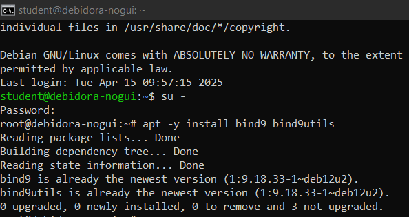

```jsx
nano /etc/bind/named.conf
```

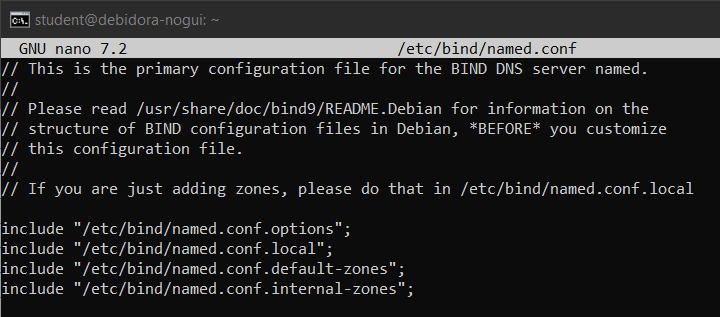

```jsx
nano /etc/bind/named.conf.options
```

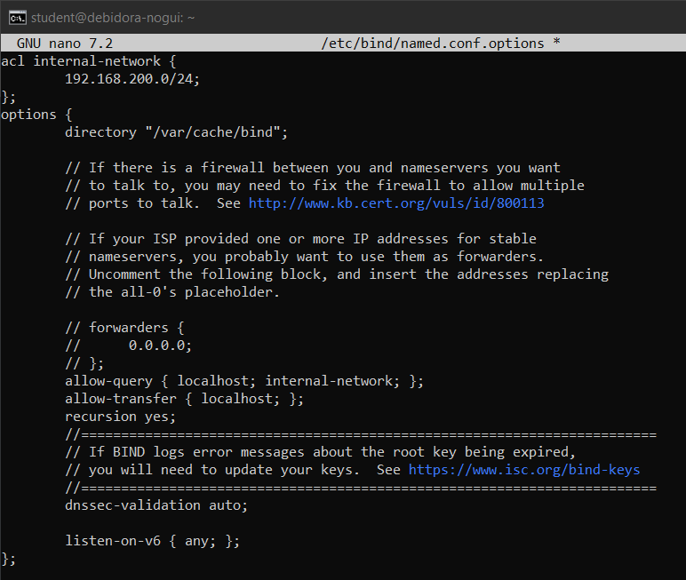

```jsx
nano /etc/bind/named.conf.internal-zones
```

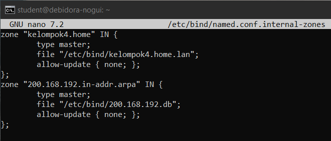

```jsx
nano /etc/default/named
```

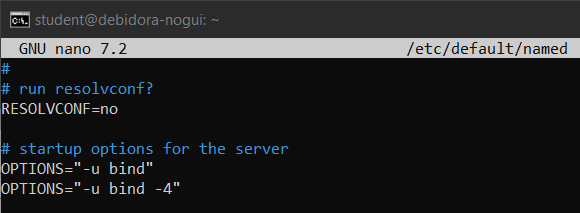

### **Konfigurasi Zone Files**

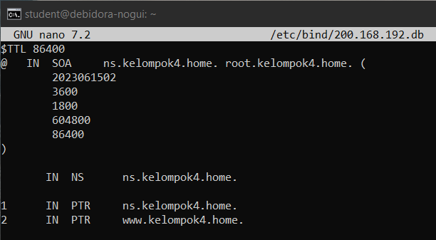

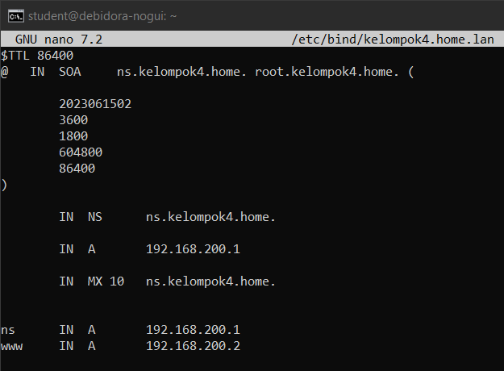

### **Testing menggunakan VM2**

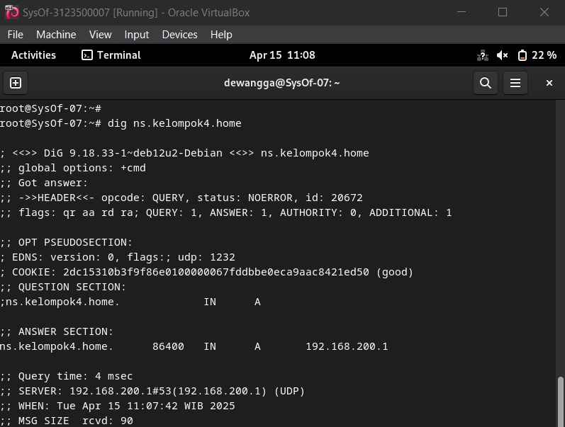

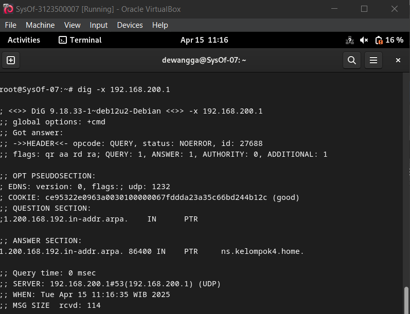